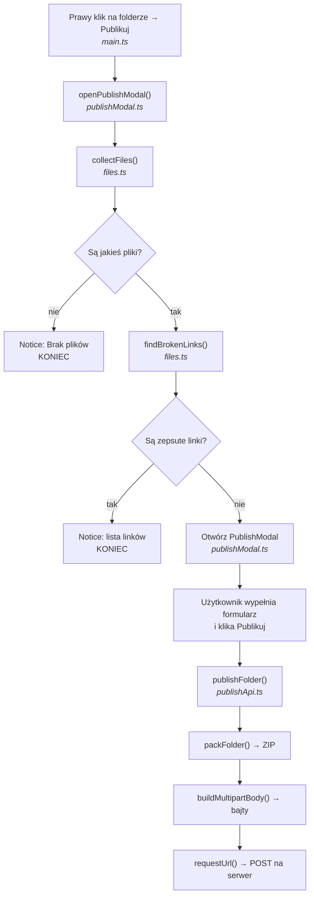

# Jak działa publikowanie folderu — wyjaśnienie od podstaw

Ten dokument tłumaczy krok po kroku, co dzieje się od momentu kliknięcia **Publikuj**
w menu kontekstowym folderu, aż do wysłania paczki na serwer.

Zakładam, że nie znasz ani API Obsidiana, ani formatu `multipart/form-data`, ani
tego jak działają dane binarne w JavaScripcie. Wszystko jest wyjaśnione po drodze.

---

## Spis treści

1. [Co ten kod właściwie robi](#1-co-ten-kod-właściwie-robi)
2. [Mapa plików](#2-mapa-plików)
3. [Przykładowy vault, na którym będziemy pracować](#3-przykładowy-vault-na-którym-będziemy-pracować)
4. [Etap 1: kliknięcie w menu](#4-etap-1-kliknięcie-w-menu)
5. [Etap 2: zebranie plików (`collectFiles`)](#5-etap-2-zebranie-plików-collectfiles)
6. [Etap 3: sprawdzenie linków (`findBrokenLinks`)](#6-etap-3-sprawdzenie-linków-findbrokenlinks)
7. [Etap 4: modal, czyli okienko formularza](#7-etap-4-modal-czyli-okienko-formularza)
8. [Etap 5: kliknięcie „Publikuj" i walidacja](#8-etap-5-kliknięcie-publikuj-i-walidacja)
9. [Etap 6: pakowanie do ZIP-a](#9-etap-6-pakowanie-do-zip-a)
10. [Etap 7: budowanie ciała `multipart/form-data`](#10-etap-7-budowanie-ciała-multipartform-data)
11. [Etap 8: wysyłka przez `requestUrl`](#11-etap-8-wysyłka-przez-requesturl)
12. [Jak wędrują błędy](#12-jak-wędrują-błędy)
13. [Co dostaje serwer](#13-co-dostaje-serwer)
14. [Pułapki i debugowanie](#14-pułapki-i-debugowanie)

---

## 1. Co ten kod właściwie robi

W skrócie: **bierze folder z vaulta, pakuje go do pliku ZIP i wysyła na serwer
razem z metadanymi** (tytuł, opis, autor, tagi).

Po drodze pilnuje dwóch rzeczy:

- żeby folder w ogóle miał co publikować,
- żeby żadna notatka nie linkowała do pliku, który zostanie *poza* paczką
  (bo po opublikowaniu taki link byłby martwy).

---

## 2. Mapa plików

Kod jest rozbity na cztery moduły, każdy z jedną odpowiedzialnością:

| Plik | Za co odpowiada |
|---|---|
| `src/main.ts` | Cykl życia pluginu. Rejestruje pozycję w menu kontekstowym. |
| `src/files.ts` | Czytanie vaulta: które pliki wziąć i czy linki są w porządku. |
| `src/publishModal.ts` | Okienko z formularzem — wyłącznie interfejs użytkownika. |
| `src/publishApi.ts` | Pakowanie ZIP-a i komunikacja HTTP z serwerem. |

Przepływ sterowania:



Kluczowa obserwacja: **walidacja dzieje się PRZED otwarciem modala.** Jeśli folder
ma zepsute linki, okienko w ogóle się nie pokaże — użytkownik zobaczy tylko
powiadomienie. To celowe: nie ma sensu kazać komuś wypełniać formularza, skoro
publikacja i tak jest niemożliwa.

---

## 3. Przykładowy vault, na którym będziemy pracować

Żeby wszystko było konkretne, przez cały dokument używam tego samego przykładu:

```
MójVault/
├── Notatki/              ← ten folder publikujemy
│   ├── Start.md
│   ├── Podstrona.md
│   ├── notatka.txt
│   ├── obrazki/
│   │   └── diagram.png
│   └── .trash/
│       └── stare.md
└── Inne/
    └── Zewnętrzna.md
```

Plik `Notatki/Start.md` zawiera:

```markdown
Zobacz [[Podstrona]] oraz ![[obrazki/diagram.png]].
Ciekawy jest też [[Zewnętrzna]].
```

Zapamiętaj ten układ — wrócimy do niego przy każdym etapie.

### Kilka pojęć Obsidiana

Zanim ruszymy, trzy typy, które będą się przewijać:

- **`TFile`** — reprezentuje plik. Ma m.in. `path` (pełna ścieżka od korzenia
  vaulta, np. `"Notatki/obrazki/diagram.png"`), `name` (`"diagram.png"`)
  i `extension` (`"png"` — **bez kropki**).
- **`TFolder`** — reprezentuje folder. Ma `path`, `name` oraz `children`, czyli
  tablicę rzeczy w środku. Uwaga: `children` zawiera **wymieszane** pliki
  i podfoldery.
- **`App`** — główny obiekt Obsidiana. Przez niego dostajemy się do vaulta
  (`app.vault`) i do indeksu metadanych (`app.metadataCache`).

---

## 4. Etap 1: kliknięcie w menu

W `src/main.ts` rejestrujemy nasłuchiwanie na zdarzenie `file-menu`. Obsidian
wywołuje je za każdym razem, gdy ktoś otworzy menu kontekstowe na pliku **lub**
folderze:

```ts
this.registerEvent(
    this.app.workspace.on('file-menu', (menu, file) => {
        if (!(file instanceof TFolder)) return;

        menu.addItem((item) =>
            item
                .setTitle('Publikuj')
                .setIcon('upload')
                .onClick(() => openPublishModal(this, file)),
        );
    }),
);
```

Trzy rzeczy warte uwagi:

**`if (!(file instanceof TFolder)) return;`** — zdarzenie odpala się też dla
pojedynczych plików. Publikujemy tylko foldery, więc dla wszystkiego innego
po prostu wychodzimy i nie dodajemy nic do menu.

**`this.registerEvent(...)`** — to nie jest ozdobnik. Owija nasłuchiwanie tak,
żeby Obsidian automatycznie je odpiął przy wyłączeniu pluginu. Bez tego przy
każdym przeładowaniu pluginu przybywałby jeden „duch" starego listenera i pozycja
„Publikuj" pojawiałaby się w menu dwa, trzy, cztery razy.

**`openPublishModal(this, file)`** — przekazujemy `this`, czyli całą instancję
pluginu, a nie samo `this.app`. Dzięki temu modal ma dostęp do `plugin.settings`
(adres API, domyślny autor). To jest właśnie ta „integracja z ustawieniami".

---

## 5. Etap 2: zebranie plików (`collectFiles`)

```ts
export function collectFiles(folder: TFolder): TFile[] {
    const result: TFile[] = [];

    for (const child of folder.children) {
        if (child instanceof TFile) {
            if (ALLOWED_EXTENSIONS.includes(child.extension)) {
                result.push(child);
            }
        } else if (child instanceof TFolder) {
            if (child.name.startsWith('.')) continue;
            result.push(...collectFiles(child));
        }
    }

    return result;
}
```

### Co to jest rekurencja i po co tu jest

Folder może zawierać podfoldery, te mogą zawierać kolejne podfoldery, i tak
w nieskończoność. Nie wiemy z góry, jak głęboko to sięga, więc nie da się tego
napisać stałą liczbą zagnieżdżonych pętli.

Rozwiązanie: funkcja **wywołuje samą siebie** dla każdego podfolderu. Mówimy jej
„ogarnij ten jeden poziom, a dla każdego podfolderu zapytaj samą siebie, co jest
w środku".

Zatrzymuje się sama, bo prędzej czy później trafi na folder bez podfolderów —
wtedy pętla nie wywoła już rekurencji i funkcja po prostu zwróci swoją listę.

### Co robi `...` (spread)

```ts
result.push(...collectFiles(child));
```

`collectFiles(child)` zwraca **tablicę**, np. `[diagram.png]`. Gdybyśmy napisali
`result.push(collectFiles(child))`, wepchnęlibyśmy tablicę *jako jeden element* —
powstałoby `[Start.md, [diagram.png]]`, czyli tablica w tablicy.

Trzy kropki „rozpakowują" tablicę na osobne argumenty, więc `push` dostaje
elementy pojedynczo i wychodzi płaska lista: `[Start.md, diagram.png]`.

### Dwa filtry

**Rozszerzenia.** `ALLOWED_EXTENSIONS` z `src/constants.ts` to:

```ts
["md", "canvas", "png", "jpg", "jpeg", "gif", "svg", "webp"]
```

Wszystko spoza tej listy wypada. To zabezpieczenie: bez niego przypadkowy plik
`.zip` albo `.mp4` w folderze wpakowałby się do paczki i wysłał na serwer.

**Foldery na kropkę.** `if (child.name.startsWith('.')) continue;` pomija
`.trash`, `.obsidian` itd. To foldery techniczne — kosz, konfiguracja, cache.
Nie mają nic wspólnego z treścią, którą publikujemy.

### Wynik dla naszego przykładu

Wywołanie `collectFiles(Notatki)` przechodzi tak:

| Element | Decyzja |
|---|---|
| `Start.md` | ✅ plik, rozszerzenie `md` jest dozwolone → bierzemy |
| `Podstrona.md` | ✅ bierzemy |
| `notatka.txt` | ❌ `txt` nie ma na liście → pomijamy |
| `obrazki/` | 🔁 folder, nie zaczyna się od kropki → wchodzimy rekurencyjnie |
| → `diagram.png` | ✅ bierzemy |
| `.trash/` | ❌ zaczyna się od kropki → pomijamy w całości |

Zwrócona tablica:

```
["Notatki/Start.md", "Notatki/Podstrona.md", "Notatki/obrazki/diagram.png"]
```

> **Uwaga: ta lista jest liczona dokładnie raz.** `openPublishModal` woła
> `collectFiles` na starcie, a potem przekazuje wynik dalej — do modala,
> a stamtąd do `packFolder`. Nikt jej nie liczy po raz drugi.
>
> To nie jest tylko oszczędność. Między walidacją linków a pakowaniem mija czas,
> w którym użytkownik wypełnia formularz. Gdyby `packFolder` liczył listę od nowa,
> notatka dodana do folderu w trakcie wypełniania trafiłaby do paczki **bez
> sprawdzenia linków**. Przekazanie listy gwarantuje, że pakujemy dokładnie ten
> zestaw plików, który przeszedł walidację.

---

## 6. Etap 3: sprawdzenie linków (`findBrokenLinks`)

```ts
export function findBrokenLinks(app: App, files: TFile[]): BrokenLink[] {
    const results: BrokenLink[] = [];
    const validPaths = new Set(files.map((file) => file.path));

    for (const file of files) {
        if (file.extension !== 'md') continue;

        const links = app.metadataCache.resolvedLinks[file.path];
        if (links === undefined) continue;

        for (const target in links) {
            if (!validPaths.has(target)) {
                results.push({ source: file.path, target });
            }
        }
    }

    return results;
}
```

### Czym jest `metadataCache.resolvedLinks`

Obsidian na bieżąco indeksuje wszystkie linki w vaulcie i trzyma je w gotowej
strukturze. `resolvedLinks` to obiekt, w którym:

- **klucz** = ścieżka pliku, który linkuje,
- **wartość** = obiekt `{ ścieżka_celu: ile_razy_zlinkowano }`.

Dla naszego przykładu wygląda to mniej więcej tak:

```js
{
  "Notatki/Start.md": {
    "Notatki/Podstrona.md": 1,
    "Notatki/obrazki/diagram.png": 1,
    "Inne/Zewnętrzna.md": 1
  },
  "Notatki/Podstrona.md": {},
  "Inne/Zewnętrzna.md": {}
}
```

Zwróć uwagę: Obsidian sam zamienił zapis `[[Podstrona]]` na pełną ścieżkę
`"Notatki/Podstrona.md"`. Nie musimy parsować markdowna ani zgadywać, o który
plik chodzi — to najtrudniejsza część roboty i dostajemy ją za darmo.

### Czym jest `Set` i po co

```ts
const validPaths = new Set(files.map((file) => file.path));
```

`Set` to zbiór unikalnych wartości z bardzo szybkim sprawdzaniem „czy to tu jest?"
(`.has()`). Można by użyć zwykłej tablicy i `.includes()`, ale wtedy dla każdego
linku JavaScript przeglądałby całą listę plików od początku. Przy 500 plikach
i 2000 linków to jest różnica między „natychmiast" a „zauważalna zwiecha".

`validPaths` to nasz zestaw plików, które **trafią do paczki**:

```
{ "Notatki/Start.md", "Notatki/Podstrona.md", "Notatki/obrazki/diagram.png" }
```

### Sama logika

Dla każdego linku pytamy: *czy cel tego linku jest w zestawie publikowanych plików?*

| Link ze `Start.md` | Jest w `validPaths`? | Werdykt |
|---|---|---|
| `Notatki/Podstrona.md` | tak | OK |
| `Notatki/obrazki/diagram.png` | tak | OK |
| `Inne/Zewnętrzna.md` | **nie** | 🔴 zepsuty |

Wynik: jeden zepsuty link. `openPublishModal` pokaże powiadomienie
`Notatki/Start.md → Inne/Zewnętrzna.md` i **nie otworzy modala**.

Ma to sens: po opublikowaniu paczki `Inne/Zewnętrzna.md` po prostu nie istnieje,
więc czytelnik kliknąłby w link donikąd.

### Ważne ograniczenie tej walidacji

Nazwa `findBrokenLinks` jest trochę myląca. Ta funkcja wykrywa **wyłącznie linki
wychodzące poza publikowany folder** — czyli takie, które w twoim vaulcie działają
poprawnie, ale po publikacji przestaną.

**Nie wykrywa** linków do plików, które w ogóle nie istnieją, np. `[[Literówka]]`.
Powód jest w API Obsidiana: takie linki nie trafiają do `resolvedLinks`, tylko do
osobnego `metadataCache.unresolvedLinks`. Nasz kod czyta tylko to pierwsze.

Jeśli chcesz łapać też literówki, trzeba dołożyć drugą pętlę po
`unresolvedLinks` — obecny kod tego nie robi.

---

## 7. Etap 4: modal, czyli okienko formularza

### Czym jest `Modal`

`Modal` to klasa z API Obsidiana — okienko wyskakujące na środku ekranu,
blokujące resztę interfejsu. Dziedziczymy po niej i dostajemy gotową obsługę
tła, zamykania Escape'em, kliknięcia poza okienkiem itd.

Dwie metody, które nadpisujemy:

- **`onOpen()`** — Obsidian woła ją, gdy okno się pokazuje. Tu budujemy zawartość.
- **`onClose()`** — woła ją przy zamknięciu. Tu sprzątamy.

Do dyspozycji mamy `this.contentEl` — pusty element HTML, który jest wnętrzem
okienka. Wszystko, co do niego wstawimy, użytkownik zobaczy.

### Konstruktor

```ts
constructor(plugin: MarketplacePlugin, folder: TFolder) {
    super(plugin.app);
    this.plugin = plugin;
    this.folder = folder;
    this.values = {
        title: folder.name,
        description: '',
        author: plugin.settings.defaultAuthor,
        tags: '',
    };
}
```

`super(plugin.app)` — klasa bazowa `Modal` wymaga obiektu `App`, więc podajemy go
z pluginu.

`this.values` to **jedno miejsce, w którym trzymamy to, co użytkownik wpisał**.
Pola startują z sensownymi wartościami zamiast pustych:

- `title` = nazwa folderu (najczęściej to jest dobry tytuł),
- `author` = `defaultAuthor` z ustawień (żeby nie wpisywać swojego nazwiska
  przy każdej publikacji).

Typ `Record<FieldKey, string>` oznacza „obiekt, w którym klucze to dokładnie
`'title' | 'description' | 'author' | 'tags'`, a wartości to stringi".
TypeScript pilnuje, żeby nie było literówki w nazwie pola.

### Budowanie formularza

Zamiast pisać cztery prawie identyczne bloki, opisujemy pola danymi:

```ts
const FIELDS: { key: FieldKey; name: string; desc?: string; multiline?: boolean }[] = [
    { key: 'title', name: 'Tytuł' },
    { key: 'description', name: 'Opis', multiline: true },
    { key: 'author', name: 'Autor' },
    { key: 'tags', name: 'Tagi', desc: 'Oddzielone przecinkami' },
];
```

i przechodzimy po nich pętlą:

```ts
for (const field of FIELDS) {
    const setting = new Setting(contentEl).setName(field.name);
    if (field.desc) setting.setDesc(field.desc);

    const value = this.values[field.key];
    const onChange = (next: string) => (this.values[field.key] = next);

    if (field.multiline) {
        setting.addTextArea((text) => text.setValue(value).onChange(onChange));
    } else {
        setting.addText((text) => text.setValue(value).onChange(onChange));
    }
}
```

**Czym jest `Setting`** — to helper Obsidiana, który rysuje jeden wiersz
formularza: etykietę po lewej, opcjonalny opis pod nią, kontrolkę po prawej.
Dzięki niemu nasz formularz wygląda identycznie jak natywne ustawienia Obsidiana,
bez pisania własnego CSS.

**Jak działa `onChange`** — to funkcja, którą Obsidian wywoła przy **każdym
naciśnięciu klawisza** w tym polu, podając aktualną treść. My od razu zapisujemy
ją do `this.values`. Nie ma więc żadnego „odczytu formularza" przy zatwierdzaniu —
`this.values` jest zawsze aktualne.

**Dlaczego `const field` w pętli jest ważne** — funkcja `onChange` zapamiętuje
(„domyka") zmienną `field`. Ponieważ `for...of` z `const` tworzy **nową** zmienną
`field` na każdym obrocie pętli, każda z czterech funkcji `onChange` widzi swoje
własne pole. Gdyby użyć `var`, wszystkie cztery wskazywałyby na ostatni element
i wpisanie czegokolwiek nadpisywałoby zawsze pole `tags`. To klasyczna pułapka
domknięć w pętli.

**Dlaczego rozróżniamy `addTextArea` i `addText`** — „Opis" bywa wielolinijkowy,
więc dostaje większe pole tekstowe. Reszta to jednolinijkowe inputy.

### Przycisk

```ts
new Setting(contentEl).addButton((button) =>
    button
        .setButtonText('Publikuj')
        .setCta()
        .onClick(() => void this.publish(button)),
);
```

`.setCta()` — „call to action", nadaje przyciskowi wyróżniony kolor akcentu.

`void this.publish(button)` — `publish` jest funkcją `async`, więc zwraca
`Promise`. `onClick` nie oczekuje żadnej wartości zwrotnej, a „wiszący" Promise,
którego nikt nie obsługuje, to typowe źródło niezauważonych błędów. Słowo `void`
mówi wprost: *świadomie ignoruję ten wynik, błędy są obsłużone w środku*.
Linter dzięki temu nie protestuje.

Zwróć uwagę, że **przekazujemy `button` do `publish`**. Dzięki temu nie musimy
trzymać przycisku w polu klasy — funkcja dostaje go w argumencie i może go
zablokować.

### Sprzątanie

```ts
onClose() {
    this.contentEl.empty();
}
```

Usuwa całą zawartość okienka z DOM. Bez tego elementy zostałyby w pamięci
przeglądarki po zamknięciu modala.

---

## 8. Etap 5: kliknięcie „Publikuj" i walidacja

```ts
private async publish(button: ButtonComponent) {
    const title = this.values.title.trim();
    const author = this.values.author.trim();
    const apiBaseUrl = this.plugin.settings.apiBaseUrl.trim();

    if (!title || !author) {
        new Notice('Tytuł i autor są wymagane');
        return;
    }
    if (!apiBaseUrl) {
        new Notice('Ustaw adres API w ustawieniach pluginu');
        return;
    }
    // ...
```

`.trim()` obcina spacje z początku i końca. Bez tego pole zawierające sam spacja
przeszłoby walidację, bo `" "` to niepusty string.

`if (!title)` — pusty string w JavaScripcie jest „fałszywy", więc ten zapis
znaczy „jeśli tytuł jest pusty".

Trzecie sprawdzenie to **integracja z ustawieniami**: jeśli użytkownik nie podał
adresu serwera w ustawieniach pluginu, nie ma dokąd wysyłać. Lepiej powiedzieć
mu to od razu niż pozwolić na kilkusekundowe pakowanie ZIP-a zakończone
niezrozumiałym błędem sieci.

### Blokada przycisku

```ts
button.buttonEl.disabled = true;
button.setButtonText('Publikowanie...');
```

Pakowanie i wysyłka trwają. Bez blokady użytkownik mógłby kliknąć „Publikuj"
pięć razy i wysłać pięć identycznych paczek.

Ustawiamy `buttonEl.disabled` bezpośrednio, zamiast używać metody
`button.setDisabled()`, bo ta ostatnia wymaga Obsidiana 1.2.3, a nasz
`manifest.json` deklaruje `minAppVersion: 1.0.0`. Właściwość `disabled` na
elemencie HTML działa wszędzie. Wyłączony przycisk nie generuje zdarzeń kliknięcia,
więc to jednocześnie nasza jedyna potrzebna ochrona przed podwójnym wysłaniem.

Tekst zmienia się na „Publikowanie...", żeby było widać, że coś się dzieje.

### Przygotowanie metadanych

```ts
tags: this.values.tags
    .split(',')
    .map((tag) => tag.trim())
    .filter((tag) => tag.length > 0),
```

Użytkownik wpisuje tagi jako jeden ciąg: `"obsidian, notatki,  ,zettelkasten"`.
Trzy operacje po kolei:

1. `.split(',')` → `["obsidian", " notatki", "  ", "zettelkasten"]`
2. `.map(trim)` → `["obsidian", "notatki", "", "zettelkasten"]`
3. `.filter(dł. > 0)` → `["obsidian", "notatki", "zettelkasten"]`

Efekt: czysta tablica, bez spacji i bez pustych wpisów po przypadkowych
podwójnych przecinkach.

Potem wołamy `publishFolder(...)` i przechodzimy do `publishApi.ts`.

---

## 9. Etap 6: pakowanie do ZIP-a

```ts
async function packFolder(
    app: App,
    folder: TFolder,
    files: TFile[],
): Promise<ArrayBuffer> {
    const zip = new JSZip();
    const prefix = folder.isRoot() ? '' : folder.path + '/';

    for (const file of files) {
        zip.file(file.path.slice(prefix.length), await app.vault.readBinary(file));
    }

    return zip.generateAsync({ type: 'arraybuffer' });
}
```

### Czym jest ZIP i po co go używamy

HTTP wysyła jedno ciało żądania. Nie ma czegoś takiego jak „wyślij 40 plików".
ZIP skleja wiele plików w jeden, zachowując przy tym strukturę folderów i nazwy —
i przy okazji je kompresuje.

`JSZip` to biblioteka, która potrafi zbudować taki plik w czystym JavaScripcie,
bez dostępu do systemu plików.

### Dane binarne: `ArrayBuffer` i `Uint8Array`

To pojęcia, które będą wracać, więc warto je ustawić raz:

- **`ArrayBuffer`** — surowy kawałek pamięci. Zna tylko swój rozmiar w bajtach.
  Nie da się z niego bezpośrednio nic odczytać, bo nie wie, jak dane interpretować.
- **`Uint8Array`** — „okulary" nałożone na `ArrayBuffer`. Pozwala patrzeć na tę
  pamięć jak na tablicę liczb 0–255 (czyli pojedynczych bajtów) i czytać oraz
  zapisywać konkretne pozycje.

Metafora: `ArrayBuffer` to zamknięty magazyn, `Uint8Array` to lista półek, dzięki
której możesz sięgnąć po konkretny przedmiot.

Obrazek PNG czy plik ZIP to **nie tekst** — to dowolne bajty, w tym takie, które
nie odpowiadają żadnemu znakowi. Dlatego wczytujemy je jako `ArrayBuffer` przez
`app.vault.readBinary(file)`, a nie jako string.

> Gdybyśmy wczytali PNG jako tekst, JavaScript spróbowałby zinterpretować bajty
> jako UTF-8, podmienił wszystkie „nieprawidłowe" sekwencje na znak zastępczy `�`
> i obrazek byłby bezpowrotnie zniszczony.

### Ścieżki względne — na czym polega `prefix`

W ZIP-ie chcemy struktury **względem publikowanego folderu**, a nie od korzenia
vaulta. Odbiorca paczki nie powinien dostać folderu `Notatki/` w środku —
on rozpakowuje właśnie te notatki.

`file.path` to ścieżka pełna. Odcinamy z niej początek:

```
prefix = "Notatki/"                      (8 znaków)

"Notatki/Start.md".slice(8)              → "Start.md"
"Notatki/obrazki/diagram.png".slice(8)   → "obrazki/diagram.png"
```

`.slice(8)` znaczy „zwróć string od 8. znaku w górę". Ponieważ każdy plik z
`collectFiles(Notatki)` na pewno zaczyna się od `"Notatki/"`, obcinamy dokładnie
tyle znaków, ile ma prefiks.

Struktura wewnątrz ZIP-a:

```
Notatki.zip
├── Start.md
├── Podstrona.md
└── obrazki/
    └── diagram.png
```

**Przypadek korzenia vaulta.** `folder.isRoot()` sprawdza, czy publikujemy cały
vault. Ścieżka korzenia to `"/"`, więc naiwne `folder.path + '/'` dałoby `"//"`
o długości 2 — a ścieżki plików w korzeniu wyglądają jak `"Start.md"`, bez
żadnego przedrostka. `.slice(2)` obcięłoby dwa pierwsze znaki *nazwy pliku*
i w ZIP-ie wylądowałoby `"art.md"`. Dlatego dla korzenia prefiks to pusty string,
a `.slice(0)` nie zmienia nic.

### `await` w pętli

```ts
for (const file of files) {
    zip.file(..., await app.vault.readBinary(file));
}
```

`readBinary` czyta plik z dysku — to operacja asynchroniczna, więc zwraca
`Promise`. `await` mówi „poczekaj, aż to się skończy, i daj mi wynik".

Pliki czytane są **po kolei**, jeden po drugim. Dałoby się szybciej przez
`Promise.all`, ale wtedy przy folderze z 500 obrazkami trzymalibyśmy je wszystkie
naraz w pamięci. Sekwencyjnie jest wolniej, za to bezpiecznie na słabszym sprzęcie
i na telefonie.

### Generowanie archiwum

```ts
return zip.generateAsync({ type: 'arraybuffer' });
```

Dopiero teraz JSZip faktycznie kompresuje dane i składa plik ZIP. Prosimy o wynik
jako `ArrayBuffer`, bo dokładnie tego wymaga funkcja `requestUrl` w kolejnym kroku.

---

## 10. Etap 7: budowanie ciała `multipart/form-data`

To najbardziej „niskopoziomowa" część kodu, więc rozłóżmy ją powoli.

### Problem do rozwiązania

Chcemy jednym żądaniem wysłać:

- cztery pola tekstowe (tytuł, opis, autor, tagi),
- jeden plik binarny (ZIP).

Ciało żądania HTTP to jeden ciąg bajtów. Musimy więc jakoś **upchnąć w nim kilka
osobnych wartości tak, żeby serwer umiał je z powrotem rozdzielić.**

Właśnie do tego służy format `multipart/form-data`. To ten sam format, którego
używa każdy formularz HTML z polem `<input type="file">`.

### Jak działa: separator

Pomysł jest prosty: wymyślamy **separator** (zwany *boundary*) — losowy ciąg
znaków, który na pewno nie wystąpi w danych — i wstawiamy go między kolejne części.

```ts
const boundary = `----ObsidianBoundary${Date.now().toString(16)}`;
```

`Date.now()` to liczba milisekund od 1970 roku, `.toString(16)` zamienia ją na
zapis szesnastkowy. Efekt to np. `----ObsidianBoundary18f2a3b4c5d`. Ponieważ
zawiera aktualny czas, jest praktycznie unikalny.

Separator musi być podany serwerowi w nagłówku, inaczej ten nie wie, czego szukać:

```ts
contentType: `multipart/form-data; boundary=${boundary}`
```

> **Uwaga na myślniki, to często myli.** W treści żądania linia separatora to
> `--` **plus** boundary. Nasz boundary sam zaczyna się od czterech myślników,
> więc w ciele zobaczysz sześć: `------ObsidianBoundary18f2a3b4c5d`.
> To nie błąd. Zakończenie to `--` + boundary + `--` na końcu.

### Jak wygląda gotowe ciało

Dla naszego przykładu (`\r\n` oznaczam jawnie, żeby było widać, gdzie kończą się
linie):

```
------ObsidianBoundary18f2a3b4c5d\r\n
Content-Disposition: form-data; name="title"\r\n
\r\n
Moje notatki\r\n
------ObsidianBoundary18f2a3b4c5d\r\n
Content-Disposition: form-data; name="description"\r\n
\r\n
Zbiór notatek o Obsidianie\r\n
------ObsidianBoundary18f2a3b4c5d\r\n
Content-Disposition: form-data; name="author"\r\n
\r\n
Adrian\r\n
------ObsidianBoundary18f2a3b4c5d\r\n
Content-Disposition: form-data; name="tags"\r\n
\r\n
obsidian,notatki\r\n
------ObsidianBoundary18f2a3b4c5d\r\n
Content-Disposition: form-data; name="file"; filename="Notatki.zip"\r\n
Content-Type: application/zip\r\n
\r\n
PK...<surowe bajty ZIP-a>...\r\n
------ObsidianBoundary18f2a3b4c5d--\r\n
```

Reguły, które z tego wynikają:

- **`\r\n`** to „powrót karetki + nowa linia" — standardowe zakończenie linii
  w protokołach internetowych. Samo `\n` nie wystarczy, część serwerów odrzuci
  takie żądanie.
- **Pusta linia** (czyli podwójne `\r\n`) oddziela nagłówki części od jej treści.
- **`Content-Disposition`** niesie nazwę pola. To po niej serwer rozpozna, że
  `"Moje notatki"` to `title`.
- Część z plikiem ma **dodatkowo** `filename` oraz własny `Content-Type`.
- Na samym końcu separator dostaje `--` z tyłu — to znak „koniec, nie ma
  więcej części".

### Dlaczego nie da się tego zrobić na stringach

Naturalny odruch to skleić wszystko jako jeden wielki string. **To by nie
zadziałało.** Bajty ZIP-a nie są poprawnym tekstem UTF-8. Przy zamianie na string
i z powrotem na bajty zostałyby uszkodzone dokładnie tak, jak opisany wyżej
zniszczony PNG.

Dlatego pracujemy na bajtach: fragmenty tekstowe zamieniamy na bajty jawnie,
a bajty ZIP-a wklejamy bez żadnej konwersji.

### `TextEncoder`

```ts
const encoder = new TextEncoder();
encoder.encode("Adrian")  // → Uint8Array [65, 100, 114, 105, 97, 110]
```

`TextEncoder` zamienia tekst na jego reprezentację w bajtach UTF-8. Litera `A`
to bajt 65, `d` to 100 itd. Polskie znaki jak `ł` zajmują dwa bajty — dlatego
`.length` na `Uint8Array` może być większy niż liczba znaków w stringu.

### Zbieranie części

```ts
const parts: Uint8Array[] = [];

for (const [name, value] of Object.entries(fields)) {
    parts.push(encoder.encode(
        `--${boundary}\r\n` +
        `Content-Disposition: form-data; name="${name}"\r\n\r\n` +
        `${value}\r\n`,
    ));
}
```

`Object.entries({title: "X", author: "Y"})` zamienia obiekt na tablicę par:
`[["title", "X"], ["author", "Y"]]`. Zapis `const [name, value]` to
destrukturyzacja — rozpakowuje każdą parę na dwie osobne zmienne.

Dla każdego pola tekstowego tworzymy jeden `Uint8Array` i dorzucamy do listy.

Potem część z plikiem — jej nagłówki i bajty trafiają jako **osobne** elementy:

```ts
const safeFilename = filename.replace(/[\r\n"]/g, '');
parts.push(encoder.encode(
    `--${boundary}\r\n` +
    `Content-Disposition: form-data; name="file"; filename="${safeFilename}"\r\n` +
    `Content-Type: application/zip\r\n\r\n`,
));
parts.push(new Uint8Array(archive));          // ← bajty ZIP-a, bez konwersji
parts.push(encoder.encode(`\r\n--${boundary}--\r\n`));
```

**Po co `safeFilename`.** Nazwa pliku bierze się z nazwy folderu, a użytkownik
może nazwać folder `Moje "notatki"`. Cudzysłów zamknąłby przedwcześnie wartość
`filename="..."` w nagłówku i serwer zinterpretowałby go błędnie. Znak nowej
linii byłby jeszcze gorszy — pozwoliłby wstrzyknąć własne nagłówki HTTP.
`replace(/[\r\n"]/g, '')` usuwa te trzy znaki. `/g` znaczy „wszystkie wystąpienia",
nie tylko pierwsze.

**`new Uint8Array(archive)`** nie kopiuje ani nie przekształca danych — zakłada
tylko „okulary" na istniejący `ArrayBuffer`, żeby móc go potraktować jak tablicę
bajtów przy sklejaniu.

### Sklejanie w jedną całość

Mamy listę kawałków, a potrzebujemy jednego ciągłego bloku pamięci:

```ts
const body = new Uint8Array(parts.reduce((size, part) => size + part.length, 0));
let offset = 0;
for (const part of parts) {
    body.set(part, offset);
    offset += part.length;
}
return body.buffer;
```

Krok po kroku:

1. **`parts.reduce((size, part) => size + part.length, 0)`** — sumuje długości
   wszystkich kawałków. `reduce` przechodzi po tablicy, niosąc ze sobą
   „akumulator": startuje od `0` i przy każdym elemencie dodaje jego długość.
   Wynik to całkowity rozmiar ciała w bajtach.

2. **`new Uint8Array(rozmiar)`** — rezerwuje blok pamięci tej wielkości,
   wypełniony zerami. Musimy znać rozmiar z góry, bo takich tablic nie da się
   rozszerzać.

3. **`body.set(part, offset)`** — wkleja kawałek do bufora, zaczynając od pozycji
   `offset`. Zmienna `offset` to nasz „kursor": po każdym wklejeniu przesuwamy go
   o długość właśnie wklejonego fragmentu.

Wizualnie:

```
parts:   [nagłówki title][nagłówki opis]...[nagłówki pliku][ZIP][zakończenie]
             120 B            98 B              145 B      52 KB     40 B

body:    ┌──────────┬────────┬─────┬──────────┬──────────────┬─────┐
         │  120 B   │  98 B  │ ... │  145 B   │    52 KB     │40 B │
         └──────────┴────────┴─────┴──────────┴──────────────┴─────┘
offset:  0          120      218        …          …            koniec
```

4. **`return body.buffer`** — `body` to widok (`Uint8Array`), a `requestUrl`
   oczekuje surowego `ArrayBuffer`. Właściwość `.buffer` zwraca ten bufor pod
   spodem. Ponieważ zarezerwowaliśmy go w dokładnie takim rozmiarze, jaki jest
   potrzebny, nie ma tam żadnych nadmiarowych bajtów.

---

## 11. Etap 8: wysyłka przez `requestUrl`

```ts
const response = await requestUrl({
    url: `${apiBaseUrl.replace(/\/+$/, '')}/publish`,
    method: 'POST',
    contentType: `multipart/form-data; boundary=${boundary}`,
    body,
    throw: false,
});

if (response.status < 200 || response.status >= 300) {
    throw new Error(`${response.status}: ${response.text}`);
}
```

### Dlaczego `requestUrl`, a nie `fetch`

`fetch` to standardowa funkcja przeglądarki. Obsidian jest zbudowany na Electronie,
czyli w środku działa przeglądarka — a to znaczy, że obowiązuje **CORS**.

CORS to mechanizm bezpieczeństwa: przeglądarka blokuje żądania do innych domen,
chyba że tamten serwer wyraźnie na to pozwoli specjalnymi nagłówkami. Dla pluginu
to problem — nie kontrolujemy każdego serwera, z którym użytkownik chce gadać.

Obsidian daje więc `requestUrl`: wysyła żądanie **poza** warstwą przeglądarki,
z procesu głównego Electrona, gdzie CORS nie obowiązuje. Zalecany sposób
komunikacji sieciowej w pluginach.

### Ograniczenie, które ukształtowało cały poprzedni rozdział

Sygnatura `requestUrl` mówi, że `body` może być typu:

```ts
body?: string | ArrayBuffer;
```

**Tylko tyle.** Nie ma `FormData`, nie ma `Blob`, nie ma strumieni.

Gdybyśmy używali `fetch`, wystarczyłoby:

```ts
const formData = new FormData();
formData.append('title', title);
formData.append('file', zipBlob, 'Notatki.zip');
fetch(url, { method: 'POST', body: formData });
```

...i przeglądarka sama zbudowałaby całe ciało multipart oraz nagłówek z boundary.
Ponieważ `requestUrl` tego nie potrafi, **musimy zrobić to ręcznie** — i dokładnie
tym jest `buildMultipartBody`.

To jest odpowiedź na pytanie „po co tyle kodu do wysłania pliku": to cena za
uniknięcie CORS-a.

### `apiBaseUrl.replace(/\/+$/, '')`

Wyrażenie regularne `/\/+$/` znaczy: „jeden lub więcej ukośników (`\/+`) na samym
końcu tekstu (`$`)". Usuwamy je, zanim dokleimy `/publish`.

Bez tego użytkownik, który w ustawieniach wpisze `https://serwer.dev/`, dostałby
adres `https://serwer.dev//publish` z podwójnym ukośnikiem. Część serwerów to
wybaczy, część zwróci 404.

### `throw: false`

Domyślnie `requestUrl` sam rzuca wyjątkiem przy statusie 400 i wyższym — ale ten
wyjątek **nie zawiera treści odpowiedzi**. Użytkownik zobaczyłby suche
„Request failed, status 422", bez informacji, co konkretnie było nie tak.

Wyłączamy to zachowanie i sprawdzamy status sami, dzięki czemu możemy dołożyć
`response.text`, czyli komunikat od serwera:

```ts
throw new Error(`${response.status}: ${response.text}`);
```

Efekt dla użytkownika: `Błąd publikacji: 422: Tytuł jest już zajęty` zamiast
`Błąd publikacji: Request failed`.

Warunek `status < 200 || status >= 300` akceptuje cały zakres sukcesu — nie tylko
`200 OK`, ale też np. `201 Created`, które serwery często zwracają po utworzeniu
nowego zasobu.

---

## 12. Jak wędrują błędy

Cały łańcuch wywołań ma **jedno** miejsce obsługi błędów — blok `try/catch`
w `publish()` w modalu. Wszystko poniżej po prostu rzuca wyjątki i pozwala im
lecieć w górę.

```
publish()                    ← try/catch JEST TUTAJ
  └─ publishFolder()
       ├─ packFolder()
       │    └─ readBinary()  ← może rzucić błędem odczytu (np. plik zniknął)
       └─ upload()           ← throw new Error('422: ...')
            └─ requestUrl()  ← może rzucić błędem sieci
```

Kiedy `upload` rzuci wyjątkiem, `publishFolder` go nie łapie — więc leci dalej,
aż do `catch` w `publish()`:

```ts
} catch (error) {
    console.error(error);
    new Notice(
        'Błąd publikacji: ' +
            (error instanceof Error ? error.message : String(error)),
    );
    button.buttonEl.disabled = false;
    button.setButtonText('Publikuj');
}
```

**Dlaczego `error instanceof Error`** — w JavaScripcie można rzucić czymkolwiek,
nie tylko obiektem `Error` (`throw "coś poszło nie tak"` jest legalne). Gdybyśmy
napisali po prostu `error.message`, przy rzuconym stringu dostalibyśmy `undefined`
w komunikacie. Sprawdzenie typu chroni przed tym: jeśli to prawdziwy `Error`,
bierzemy `.message`, w przeciwnym razie zamieniamy cokolwiek to jest na tekst.

**`console.error(error)`** zapisuje pełny błąd wraz ze stack trace do konsoli
dewelopera (`Ctrl/Cmd + Shift + I`). `Notice` pokazuje tylko krótki komunikat,
a przy diagnozie potrzebny jest cały kontekst.

**Odblokowanie przycisku dzieje się tylko w `catch`** — i to jest celowe.
Po sukcesie wołamy `this.close()`, więc okienko znika razem z przyciskiem;
przywracanie mu stanu nie miałoby sensu. Po błędzie okno zostaje otwarte
z wypełnionymi polami, żeby użytkownik mógł poprawić dane i spróbować ponownie.

---

## 13. Co dostaje serwer

Serwer pod adresem `POST {apiBaseUrl}/publish` otrzymuje standardowy formularz
`multipart/form-data` z pięcioma polami:

| Pole | Typ | Zawartość |
|---|---|---|
| `title` | tekst | Tytuł, przycięty. Nigdy pusty. |
| `description` | tekst | Opis, przycięty. Może być pusty. |
| `author` | tekst | Autor, przycięty. Nigdy pusty. |
| `tags` | tekst | Tagi połączone przecinkami, np. `obsidian,notatki`. Może być pusty. |
| `file` | plik | Archiwum ZIP, `Content-Type: application/zip`. |

Z perspektywy serwera to zwykły upload z formularza. W Cloudflare Workers
odczytasz to tak:

```js
export default {
    async fetch(request) {
        const form = await request.formData();

        const title = form.get('title');
        const tags = String(form.get('tags')).split(',').filter(Boolean);
        const zip = form.get('file');   // obiekt File

        // ...zapis do R2 / bazy...

        return new Response('OK', { status: 201 });
    },
};
```

Jeśli chcesz zwrócić błąd, użyj statusu 4xx/5xx i wpisz **czytelny komunikat
w treści odpowiedzi** — plugin pokaże go użytkownikowi dosłownie.

---

## 14. Pułapki i debugowanie

### „Nic się nie dzieje po kliknięciu Publikuj"

Najpewniej zadziałała walidacja i pojawiło się powiadomienie, którego nie
zauważyłeś. Możliwe przyczyny, w kolejności prawdopodobieństwa:

1. **Nie ustawiony adres API** — Ustawienia → nasz plugin → „Adres API".
2. **Zepsuty link** — modal nie otworzy się w ogóle, zobaczysz listę linków.
3. **Folder bez pasujących plików** — np. same pliki `.txt`.

### „Pusty tytuł/autor mimo że wpisałem"

`.trim()` obcina spacje, więc pole zawierające same spacje liczy się jako puste.

### Zepsuty link, którego nie rozumiesz

Powiadomienie pokazuje `źródło → cel`. Cel to plik **poza** publikowanym folderem.
Masz trzy wyjścia: przenieść cel do folderu, usunąć link, albo opublikować
nadrzędny folder obejmujący oba pliki.

Pamiętaj o [ograniczeniu opisanym w rozdziale 6](#ważne-ograniczenie-tej-walidacji):
literówki w nazwach (`[[NieIstnieje]]`) **nie** są wykrywane.

### Serwer zwraca błąd parsowania formularza

Sprawdź w konsoli, czy `boundary` w nagłówku `Content-Type` zgadza się z tym
w ciele żądania. To zawsze ta sama zmienna w kodzie, więc rozjazd oznaczałby
błąd w `upload()`.

Drugi typowy powód: serwer wymaga `Content-Length`. `requestUrl` ustawia go sam
na podstawie długości `ArrayBuffer`.

### Uszkodzony ZIP po stronie serwera

Objaw prawie zawsze ten sam: gdzieś po drodze bajty przeszły przez string.
W obecnym kodzie ZIP jest wklejany jako `new Uint8Array(archive)` bez żadnej
konwersji — jeśli będziesz to zmieniać, **nie zamieniaj tego fragmentu na tekst**.

### Podgląd zawartości paczki

Najprościej wstawić tymczasowo przed `return` w `packFolder`:

```ts
console.log(Object.keys(zip.files));
```

Wypisze wszystkie ścieżki w archiwum — od razu widać, czy prefiks został obcięty
poprawnie i czy nie wpadło nic zbędnego.

### Ile plików faktycznie zostanie spakowanych

```ts
console.log(collectFiles(folder).map((f) => f.path));
```

Wywołane w konsoli dewelopera pokaże dokładnie tę listę, którą zobaczy
`packFolder`.

---

## Podsumowanie w jednym akapicie

Klikasz „Publikuj" na folderze. `collectFiles` schodzi rekurencyjnie w dół,
zbierając pliki o dozwolonych rozszerzeniach i pomijając foldery techniczne.
`findBrokenLinks` pyta indeks Obsidiana o linki i sprawdza, czy któryś nie
wychodzi poza ten zestaw — jeśli tak, publikacja jest wstrzymana, zanim
zobaczysz formularz. Modal zbiera metadane, trzymając je na bieżąco w
`this.values`. Po zatwierdzeniu `packFolder` czyta pliki jako surowe bajty
i składa z nich ZIP ze ścieżkami względnymi. Ponieważ `requestUrl` przyjmuje
wyłącznie `ArrayBuffer`, `buildMultipartBody` ręcznie skleja pola tekstowe
i bajty archiwum w jedno ciało `multipart/form-data` rozdzielone losowym
separatorem. Całość leci POST-em na `{apiBaseUrl}/publish`, a każdy błąd po
drodze wędruje w górę do jednego `catch`, który pokazuje go użytkownikowi
i odblokowuje przycisk.
